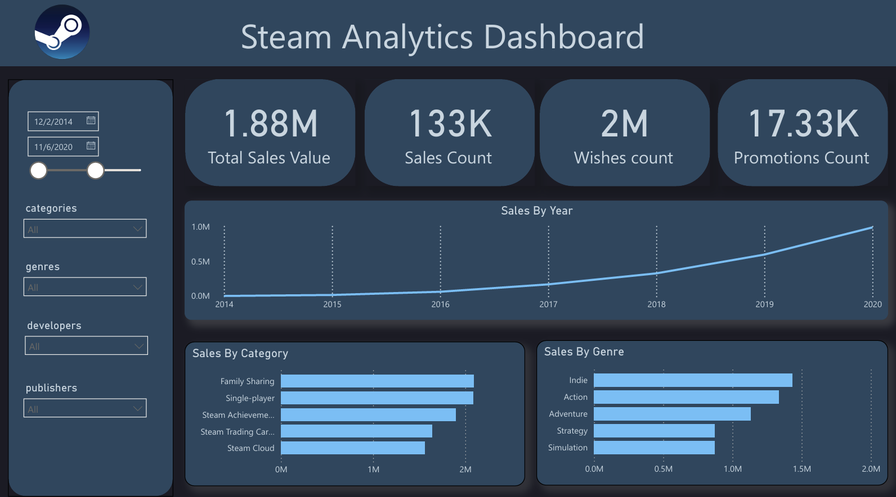
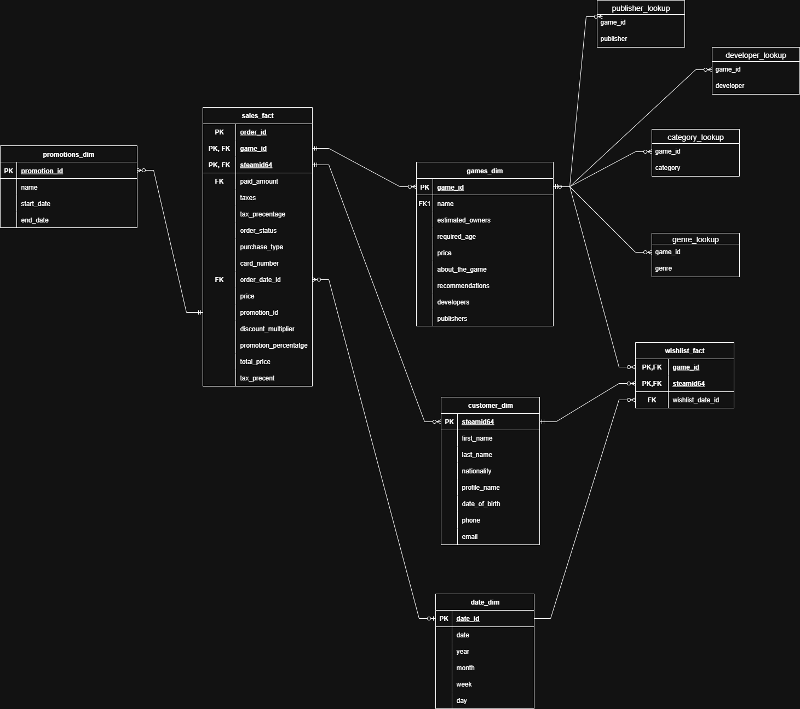
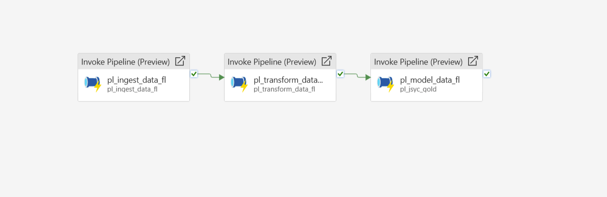

# 🎮 game-sales-fabric-pipeline

An end-to-end data platform for processing and analyzing game sales and user engagement data using **Microsoft Fabric Lakehouse**, **PySpark**, and **Power BI**.

This project ingests raw data from AWS and PostgreSQL, cleans and transforms it into curated Delta tables, logs SLA metrics, and delivers interactive dashboards for sales, promotions, and customer retention.

---

## 📊 Key Features

- **Data Ingestion**: Weekly batch loads from AWS S3 and PostgreSQL into OneLake (raw → staging).
- **ETL Pipelines**: Data cleansing, validation, and transformation using PySpark notebooks and managed Delta tables.
- **Star Schema Modeling**: Fact and dimension tables for sales, wishlist, games, customers, promotions, and more.
- **SLA Monitoring**: Tracks rows in/out, freshness hours, completeness ratio, and SLA compliance per pipeline run.
- **Data Quality Checks**: Completeness, uniqueness, validity, referential integrity with logging to Delta tables.
- **Power BI Dashboard**: Live reports for sales KPIs, wishlist conversions, promotion ROI, and customer retention.
- **Governance**: Lineage tracking, schema drift detection, PII masking, and row-level security.
- **Version Control**: Azure DevOps Git integration with export/mirroring to GitHub for portfolio visibility.

---

## 🚀 Pipeline Flow

1. **Ingest**  
   - Load raw files (CSV/Parquet) and SQL tables into `raw` Delta tables.

2. **Transform**  
   - Clean and validate data, apply business rules (e.g., tax by country), and build star schema in `gold` layer.

3. **Log SLA**  
   - Record run ID, rows processed, freshness, and SLA status in a monitoring table.

4. **Visualize**  
   - Power BI dashboard shows real-time business KPIs.
---

## 📈 KPIs Tracked

- Total Revenue, Average Order Value (AOV)
- Total Wishlists
- Total Orders
- Total Promotion

---

## 🛠 Technologies

- Microsoft Fabric (Lakehouse, Pipelines, Power BI)
- PySpark, Delta Lake

---

## 📄 License

This project is for educational and portfolio purposes. No real user data is included.

---
## 📂 Project Structure
game-sales-fabric-pipeline/
├── 1_bronze/                 # Raw ingestion layer (Lakehouse, pipelines, scripts)
│   ├── Scripts/              # Notebooks for ingestion and SLA logging
│   ├── lh_bronze/            # Lakehouse bronze data (Delta tables)
│   └── pipelines/            # Pipeline images + zipped pipeline export

├── 2_silver/                 # Cleaned and validated data layer
│   ├── lh_silver/            # Lakehouse silver data
│   ├── scripts/              # Cleaning, profiling, and SLA notebooks
│   └── pipelines/            # Pipeline visuals and dataflow

├── 3_gold/                   # Star-schema and analytics layer
│   ├── lh_gold/              # Lakehouse gold data
│   ├── scripts/              # Notebooks for dimensions and facts
│   └── pipelines/            # Gold pipeline visual and export

├── 4_dwh_steam/              # (Optional) Data warehouse integration or archive

├── main/                     # Metadata CSVs defining validation rules per layer
│   ├── meta_data_bronze.csv
│   └── meta_data_silver.csv

├── steam_dashboard.pbix      # Power BI dashboard (live reports)
├── steam_dashboard.pdf       # Dashboard preview as PDF
├── PowerBI_Semantic_model.png# Semantic model diagram
├── steam_model.png           # ERD or data model diagram

├── pl_full_pipeline.zip      # Full Fabric pipeline export
├── jsyc_usecase.pdf          # Project BRD or reference document
├── LICENSE
├── README.md

## 📊 Dashboard Preview

## 🗺️ Data Model Overview

## 🔄 Pipeline Overview

## 👤 Author

**Abdelrhman Eldesoky**  
New Cairo, Egypt  
Email: abdelrhmaneldesoky@gmail.com  
GitHub: [github.com/desoky231](https://github.com/desoky231)  
LinkedIn: [linkedin.com/in/abdelrhman-eldesoky](https://www.linkedin.com/in/abdelrhman-eldesoky-09743a1b4/)
